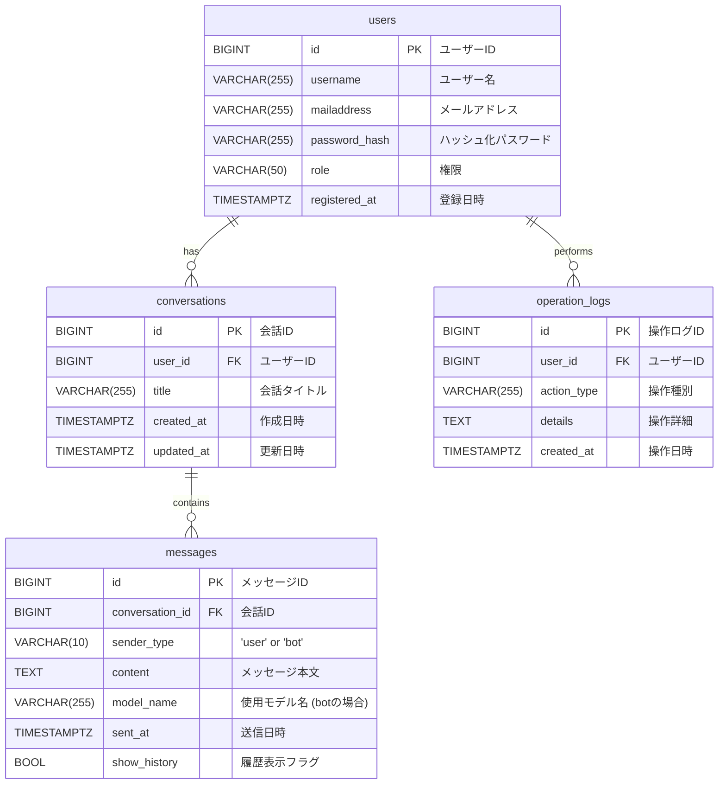

# データベース設計書 (ER図)

## テーブル定義

    users: ユーザー情報

    conversations: 会話セッション

    messages: 個々のメッセージ

    operation_logs: 管理操作ログ

```mermaid

erDiagram
    users {
        BIGINT id PK "ユーザーID"
        VARCHAR(255) username "ユーザー名"
        VARCHAR(255) mailaddress "メールアドレス"
        VARCHAR(255) password_hash "ハッシュ化パスワード"
        VARCHAR(50) role "権限"
        TIMESTAMPTZ registered_at "登録日時"
    }

    conversations {
        BIGINT id PK "会話ID"
        BIGINT user_id FK "ユーザーID"
        VARCHAR(255) title "会話タイトル"
        TIMESTAMPTZ created_at "作成日時"
        TIMESTAMPTZ updated_at "更新日時"
    }

    messages {
        BIGINT id PK "メッセージID"
        BIGINT conversation_id FK "会話ID"
        VARCHAR(10) sender_type "'user' or 'bot'"
        TEXT content "メッセージ本文"
        VARCHAR(255) model_name "使用モデル名 (botの場合)"
        TIMESTAMPTZ sent_at "送信日時"
        BOOL show_history "履歴表示フラグ"
    }

    operation_logs {
        BIGINT id PK "操作ログID"
        BIGINT user_id FK "ユーザーID"
        VARCHAR(255) action_type "操作種別"
        TEXT details "操作詳細"
        TIMESTAMPTZ created_at "操作日時"
    }

    users ||--o{ conversations : "has"
    conversations ||--o{ messages : "contains"
    users ||--o{ operation_logs : "performs"

```