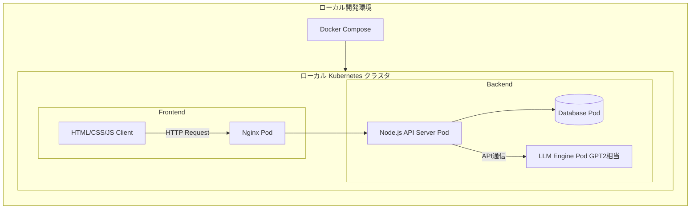

<!-- 要件定義書 -->

# チャットボットアプリ開発
## 要件定義からテストまで

バージョン：1.0.0

担当者：河田祐一

最終更新日：2025年10月7日

# 1. システム概要
-   目的： スクラッチ開発したGPT-2相当のLLMへAPI経由で通信を行い、フロントエンドのチャットUIから利用出来るようなアプリを作成
-   利用環境：Windows11, Visual Studio Code, Docker Desktop
-   主要要素：
    -   フロントエンド：HTML, CSS, JS / ポート番号 : 8080
    -   バックエンド：Node.js / ポート番号 : 3000
    -   LLM推論コンテナ：Python / ポート番号 : 5000
    -   DBコンテナ：PostgreSQL / ポート番号 : 5432
-   管理：GitHubリポジトリにて一元管理

## A. システム構成図

## B. 開発に至った背景
参画現場では機械学習やAIに限らず、幅広く様々な領域の仕事をさせていただきました。  
一部、Kubernetesやスクラッチ開発LLMなど自己学習によるものもありますが、現場と自己学習で学んだ事を形にして、自身のスキルの証明としたいため

## C. 定義
この要件定義書内においてのLLMはスクラッチ開発したLLMのことを指す。

# 2. 業務要件

## A. 業務フロー
個人開発のため特になし

## B. 規模
-   日次処理数：10件程度
-   同時ログインユーザー：1人

## C. 時期・時間
-   アクセスが集中する時間帯や日次,週次の処理などもない

## D. 指標
-   回答の正確性
-   待機時間
今回は処理能力などのスペック周りは一旦無視

## E. スコープ
対象範囲：ユーザーからの質問についての応答
対象外：RAGによる回答

# 3. 機能要件

## A. 機能一覧

| 画面No  | 画面名        | 機能No | 機能名            | 機能概要                            | 権限/備考           |
| ----- | ---------- | ---- | -------------- | ------------------------------- | --------------- |
| **1** | **チャット画面** | 1-1  | メッセージ送受信       | ユーザーの入力メッセージを送信し、Bot（LLM）の返信を表示 | 全ユーザー           |
|       |            | 1-2  | 会話履歴表示         | 過去の会話ログを時系列で表示                  | 全ユーザー           |
|       |            | 1-3  | 会話履歴クリア        | 会話履歴をリセット（DBまたはローカルストレージ）       | 全ユーザー           |
|       |            | 1-4  | 会話エクスポート/インポート | JSONまたはCSV形式で履歴を入出力             | 全ユーザー           |
|       |            | 1-5  | 新しい会話を開始       | 新規セッションを開始                      | 全ユーザー           |
|       |            | 1-6  | 会話中止           | 応答生成処理を中断                       | 全ユーザー           |
|       |            | 1-7  | 管理画面遷移         | 管理者ロールによりアクセス制御（Adminのみ）        | 認証済みユーザー（Admin） |
| **2** | **管理画面**   | 2-1  | ログ閲覧           | システムログ・会話ログの閲覧                  | 管理者のみ           |
|       |           | 2-2  | ログエクスポート           | システムログ・会話ログのエクスポート                  | 管理者のみ           |
|       |           | 2-3  | 権限管理         | 登録中ユーザーの権限管理                  | 管理者のみ           |
| **3** | **ログイン画面** | 3-1  | ログイン認証         | メールアドレス・パスワードによるログイン            | 全ユーザー           |
|       |            | 3-2  | 新規登録リンク        | 新規登録画面への遷移                      | 全ユーザー           |
| **4** | **新規登録画面** | 4-1  | 登録処理           | メールアドレス・パスワードをDBに登録             | 全ユーザー           |
| **5** | **将来的機能**  | 5-1  | モデル切替          | LLMの切り替え（例：スクラッチモデル / 外部API）    | 管理者想定           |
|       |            | 5-2  | ダッシュボード        | 各種統計・利用状況の可視化                   | 管理者想定           |

---

## B. 各画面の構成要素

### チャット画面
#### B-1-1. チャット画面構成要素

| 要素No | 要素名       | 種別       | 内容・役割                     | 関連機能No |
| ---- | --------- | -------- | ------------------------- | ------ |
| 1    | メッセージ入力欄  | テキストボックス | ユーザーの発言を入力する欄             | 1-1    |
| 2    | 送信ボタン     | ボタン      | 入力内容を送信し、バックエンドAPIを呼び出す   | 1-1    |
| 3    | 応答エリア     | 表示領域     | Botの返答を表示（メッセージ単位で整形）     | 1-1    |
| 4    | 履歴一覧      | スクロールエリア | 過去の会話履歴を上から順に表示           | 1-2    |
| 5    | 新しい会話ボタン  | ボタン      | 現在のセッションをクリアして新しい会話を開始    | 1-5    |
| 6    | 履歴クリアボタン  | ボタン      | 表示中の会話履歴を全削除              | 1-3    |
| 7    | エクスポートボタン | ボタン      | 現在の会話をJSONまたはCSVとしてダウンロード | 1-4    |
| 8    | インポートボタン  | ボタン      | ローカルファイルから会話履歴を読み込み表示     | 1-4    |
| 9    | 管理画面遷移ボタン | ボタン      | 権限があれば管理画面へ移動（Adminのみ有効）  | 1-6    |

---

#### B-1-2. 機能仕様（バックエンド連携）

| 関連機能No | 機能名     | 使用API                     | メソッド   | 入力データ例                                     | 出力データ例                            |
| ------ | ------- | ------------------------- | ------ | ------------------------------------------ | --------------------------------- |
| 1-1    | メッセージ送信 | `/api/v1/conversations/{id}/messages`          | POST   | `{ "message": "こんにちは" }` | `{ "reply": "こんにちは！ご機嫌いかがですか？" }` |
| 1-2    | 会話履歴取得  | `/api/v1/conversations/{id}/messages`       | GET    | user_id                                    | 会話ログ（JSON配列）                      |
| 1-3    | 会話履歴削除  | `/api/v1/conversations/{id}` | PATCH | `{"show_history": false}`| `{"status": success}`  |
| 1-4    | エクスポート  | クライアント側処理                 | -      | -                                          | JSON/CSVファイル                      |
| 1-4    | インポート   | クライアント側処理                 | -      | ファイルアップロード                                 | 履歴反映                              |
| 1-5    | 新しい会話を始める   | `/api/v1/conversations` | POST | | 新しい会話セッションを作成し、そのIDを返す　|
| 1-6    | 管理画面遷移   | クライアント処理 | - | - | 管理者ページログイン画面へ遷移|
| 1-7    | 履歴タイトル一覧取得   | `/api/v1/conversations` | GET | conversation_id | 会話タイトル一覧(JSON配列)|

---

### 管理画面
#### B-2-1. 管理画面構成要素

| 要素名 | 種別 | 機能No | 内容・役割 |
|----------|--------|--------|-------------|
| ログ一覧テーブル | 表 | 2-1 | 会話ログ・システムログを一覧表示（日時・ユーザー・種別など） |
| エクスポートボタン | ボタン | 2-2 | 表示中のログをCSV形式でエクスポート |
| ユーザー管理 | 表&ボタン | 2-3 | 登録中ユーザーの権限管理 |
---

#### B-2-2. 機能仕様（バックエンド連携）

| 機能No | 機能 | 使用API | メソッド | 入力データ例 | 出力データ例 |
|---------|--------|-----------|-------------|----------------|----------------|
| 2-1 | ログ一覧取得 | `/api/v1/admin/logs` | GET | `{ "page": 1, "limit": 50 }` | ログ配列(JSON) |
| 2-2 | エクスポート | `/api/v1/admin/logs/export` | GET | `?format=csv` | CSV/JSONファイル |
| 2-3 | 権限管理 | `/api/v1/auth/role` | PATCH | `{"address": "example@test.com", "role": "admin"}` | `{"status": "success"}` |
---

### ログイン画面
#### B-3-1. ログイン画面構成要素

| 要素名 | 種別 | 機能No | 内容・役割 |
|----------|--------|--------|-------------|
| メールアドレス入力欄 | テキストボックス | 3-1 | 登録済みメールアドレス入力欄 |
| パスワード入力欄 | テキストボックス | 3-1 | 登録済みパスワード入力欄 |
| ログイン | ボタン | 3-1 | ログインボタン |
| 新規登録リンク | リンク | 3-2 | 新規登録画面へ遷移 |
---

#### B-3-2. 機能仕様（バックエンド連携）

| 機能No | 機能 | 使用API | メソッド | 入力データ例 | 出力データ例 |
|---------|--------|-----------|-------------|----------------|----------------|
| 3-1 | ログイン | `/api/v1/auth/login` | POST | `{"address": "example@test.com", "password": "password"}` | `{"status": "success"}` |
| 3-2 | 新規登録リンク | クライアント側処理 | - | - | 新規登録画面へ遷移 |
---

### 新規登録画面
#### B-4-1. 新規登録画面構成要素

| 要素名 | 種別 | 機能No | 内容・役割 |
|----------|--------|--------|-------------|
| メールアドレス入力欄 | テキストボックス | 4-1 | メールアドレス入力欄 |
| パスワード入力欄 | テキストボックス | 4-1 | パスワード入力欄 |
| 新規登録 | ボタン | 4-1 | DBへ登録処理 |
---

#### B-4-2. 機能仕様（バックエンド連携）

| 機能No | 機能 | 使用API | メソッド | 入力データ例 | 出力データ例 |
|---------|--------|-----------|-------------|----------------|----------------|
| 4-1 | 新規登録 | `/api/v1/auth/register` | POST | `{"address": "example@test.com", "password": "password"}` | `{"status": "success"}` |
---

## C. 情報・データログ

### DBスキーマ

#### ユーザーテーブル
| テーブル名 | カラム名 | 型 | 制約 |
|----------|----------|----------|----------|
|users|id|BIGINT|PRIMARY KEY|
|users|username|VARCHAR(255)|NOT NULL|
|users|mailaddress|VARCHAR(255)|NOT NULL UNIQUE|
|users|password_hash|VARCHAR(255)|NOT NULL|
|users|role|VARCHAR(50)|NOT NULL DEFAULT 'user'|
|users|registered_at|TIMESTAMP|WITH TIME ZONE DEFAULT now()|
---

#### 会話管理テーブル
| テーブル名 | カラム名 | 型 | 制約 |
|----------|----------|----------|----------|
|conversations|id|BIGINT|PRIMARY KEY|
|conversations|user_id|BIGINT|NOT NULL FOREIGN KEY (users.id)|
|conversations|title|VARCHAR(255)|NOT NULL|
|conversations|created_at|TIMESTAMP|WITH TIME ZONE DEFAULT now()|
|conversations|updated_at|TIMESTAMP|WITH TIME ZONE DEFAULT now()|
|conversations|show_history|BOOL|NOT NULL DEFAULT 'true'|

#### メッセージ管理テーブル
| テーブル名 | カラム名 | 型 | 制約 |
|----------|----------|----------|----------|
|messages|id|BIGINT|PRIMARY KEY|
|messages|conversation_id|BIGINT|NOT NULL FOREIGN KEY (conversations.id)|
|messages|sender_type|VARCHAR(10)|NOT NULL|
|messages|content|TEXT|NOT NULL|
|messages|model_name|VARCHAR(255)|NULL|
|messages|sent_at|TIMESTAMP|WITH TIME ZONE DEFAULT now()|
---

#### 管理ログ
| テーブル名 | カラム名 | 型 | 制約 |
|----------|----------|----------|----------|
|operation_logs|id|BIGINT|PRIMARY KEY|
|operation_logs|user_id|BIGINT|NOT NULL FOREIGN KEY(users.id)|
|operation_logs|action_type|VARCHAR(255)|NOT NULL|
|operation_logs|details|TEXT|NOT NULL|
|operation_logs|created_at|TIMESTAMP|WITH TIME ZONE DEFAULT now()|
---

## D. 外部インターフェース
| インターフェース名 | 接続先 | 目的 | 備考 |
|----------|----------|----------|----------|
|OPEN AI API|OPEN AI|回答LLMにGPTモデルを使用|将来拡張時|
---

# 4. 非機能要件

## 4-A. 性能要件

| 要件No  | 要件名   | 内容・仕様                           | 優先度 |
| ----- | ----- | ------------------------------- | --- |
| 4-A-1 | 応答速度  | LLM応答生成完了までの待機時間は平均10秒以内を目安      | 高   |
| 4-A-2 | 同時接続数 | 同時ログインユーザーは1人を想定（将来的に10人まで対応可能） | 中   |
| 4-A-3 | データ容量 | 会話履歴・ログは最大1万件程度保存可能             | 低   |

---

## 4-B. セキュリティ要件

| 要件No  | 要件名         | 内容・仕様                             | 優先度 |
| ----- | ----------- | --------------------------------- | --- |
| 4-B-1 | 認証          | メールアドレス・パスワードによるログインを必須。セッションべベース認証を採用(DBセッション)  | 高   |
| 4-B-2 | パスワード保護     | パスワードはハッシュ化してDBに保存（Argon2） | 高   |
| 4-B-3 | 権限管理        | 管理画面はAdminのみアクセス可能                | 高   |
| 4-B-4 | 通信暗号化       | ローカル開発段階はHTTPでも可だが、K8s移行時はHTTPS推奨 | 中   |
| 4-B-5 | インポートファイル検証 | JSON/CSV形式の不正データは拒否               | 高   |
| 4-B-6 | SQLインジェクション | コード内にて対策必須               | 高   |
| 4-B-7 | セッション管理の不備 | セッションストアを用いて管理               | 高   |
| 4-B-8 | XSS | コード内にて対策必須               | 高   |
| 4-B-9 | CSRF | コード内にて対策必須               | 高   |
| 4-B-10 | クリックジャギング | コード内にて対策必須               | 高   |
| 4-B-11 | 認可 | 管理画面に対する認可は必要               | 高   |
| 4-B-12 | ログインレート | 15分間に5回を上限とする               | 高   |

---

## 4-C. 可用性・信頼性要件

| 要件No  | 要件名      | 内容・仕様                        | 優先度 |
| ----- | -------- | ---------------------------- | --- |
| 4-C-1 | 障害対応     | LLMプロセスが停止した場合はエラーを表示し、再起動可能 | 中   |
| 4-C-2 | データ保全    | 会話履歴の削除・クリア時にはユーザー確認ダイアログ表示  | 高   |
| 4-C-3 | システム稼働時間 | 今回は検討不要         |   |

---

## 4-D. 保守性・運用性要件

| 要件No  | 要件名     | 内容・仕様                     | 優先度 |
| ----- | ------- | ------------------------- | --- |
| 4-D-1 | ログ管理    | システム・会話ログは管理画面から確認可能      | 高   |
| 4-D-2 | モジュール分離 | フロントエンド・バックエンド・LLMをコンテナ分離 | 高   |
| 4-D-3 | バージョン管理 | GitHubでソースコードとドキュメントを一元管理 | 高   |
| 4-D-4 | 拡張性     | 将来的にLLMモデル差替え・ダッシュボード追加可能 | 低   |

---

## 4-E. ユーザビリティ要件

| 要件No  | 要件名      | 内容・仕様                         | 優先度 |
| ----- | -------- | ----------------------------- | --- |
| 4-E-1 | 操作性      | ボタン・入力欄は直感的で、UIは最小限のクリックで操作可能 | 高   |
| 4-E-2 | メッセージ表示  | 会話履歴はスクロール可能で、最新メッセージが自動表示    | 高   |
| 4-E-3 | エラーメッセージ | 入力不正やシステムエラーは画面上に明確に通知        | 高   |
| 4-E-4 | レスポンシブデザイン | スマホ、タブレット対応  | 低 |

---

# 5. ドキュメント更新履歴

| バージョン | 日時 | 更新者 | 内容 |
|----------|----------|----------|----------|
|1.0.0|2025年10月8日 21時57分|河田祐一|初版作成|
|1.0.1|2025年10月9日 22時00分|河田祐一|1.システム概要にポート番号追記|
|1.0.2|2025年10月11日 20時45分|河田祐一|B-2-2/2-3権限管理のメソッドをPOSTからPATCHへ変更|
|1.0.3|2025年10月12日 21時30分|河田祐一|会話管理テーブルにshow_historyを追加、メッセージ管理テーブルからshow_historyを削除|
|1.0.4|2025年10月12日 22時22分|河田祐一|チャット画面に履歴タイトル一覧取得 `/api/v1/conversations`を追加|
