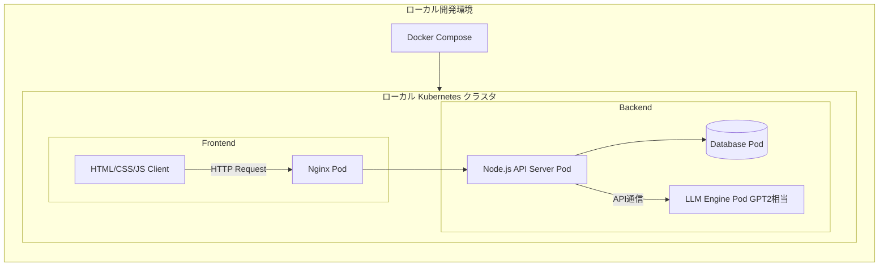

<!-- 要件定義書 -->

# チャットボットアプリ開発
## 要件定義からテストまで

バージョン：1.0.0

担当者：河田祐一

最終更新日：2025年10月7日

# 1. システム概要
-   目的： スクラッチ開発したGPT-2相当のLLMへAPI経由で通信を行い、フロントエンドのチャットUIから利用出来るようなアプリを作成
-   利用環境：Windows11, Visual Studio Code, Docker Desktop
-   主要要素：
    -   フロントエンド：HTML, CSS, JS
    -   バックエンド：Node.js
    -   LLM推論コンテナ：Python
    -   DBコンテナ：PostgreSQL, MongoDB
-   管理：GitHubリポジトリにて一元管理

## A. システム構成図

## B. 開発に至った背景
参画現場では機械学習やAIに限らず、幅広く様々な領域の仕事をさせていただきました。  
一部、Kubernetesやスクラッチ開発LLMなど自己学習によるものもありますが、現場と自己学習で学んだ事を形にして、自身のスキルの証明としたいため

## C. 定義
この要件定義書内においてのLLMはスクラッチ開発したLLMのことを指す。

# 2. 業務要件

## A. 業務フロー
個人開発のため特になし

## B. 規模
-   日次処理数：10件程度
-   同時ログインユーザー：1人

## C. 時期・時間
-   アクセスが集中する時間帯や日次,週次の処理などもない

## D. 指標
-   回答の正確性
-   待機時間
今回は処理能力などのスペック周りは一旦無視

## E. スコープ
対象範囲：ユーザーからの質問についての応答
対象外：RAGによる回答

# 3. 機能要件