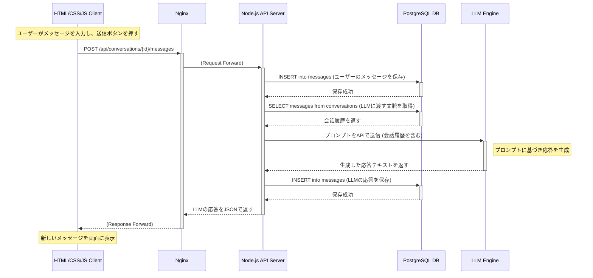

# シーケンス図

このドキュメントでは、システムの主要な機能がどのような順序で、どのコンポーネント間で連携して動作するかを定義します。

## 1. メッセージ送受信シーケンス

ユーザーがチャット画面でメッセージを送信し、LLMからの応答が画面に表示されるまでの一連の流れ。

## 2. シーケンスの解説

    ユーザー操作: ユーザーがブラウザ（Client）でメッセージを送信します。

    APIリクエスト: Clientは、Nginx経由でNode.js APIサーバーにPOSTリクエストを送信します。

    ユーザーメッセージ保存: Node.jsサーバーは、受け取ったメッセージをまずPostgreSQL DBに保存します。

    コンテキスト取得: 次に、LLMに渡すための過去の会話履歴（コンテキスト）をDBから取得します。

    LLMへの問い合わせ: Node.jsサーバーは、取得した会話履歴と新しいメッセージを添えて、LLM Engineに推論リクエストを送ります。

    LLM応答保存: LLMから応答が返ってくると、Node.jsサーバーはその内容もDBに保存します。

    APIレスポンス: 最後に、Node.jsサーバーはLLMの応答をClientに返します。

    画面表示: Clientは受け取った応答メッセージをチャット画面に描画します。